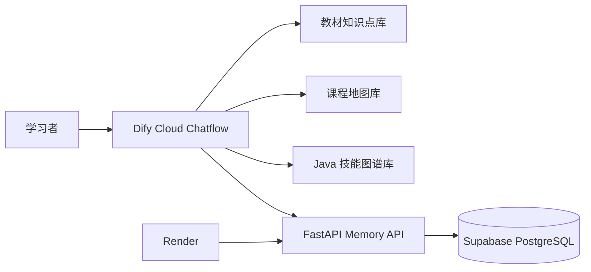

# CodeMentor AI

面向 Java 初学者的个性化 AI 学习助手。项目基于 Dify Cloud Chatflow 构建，结合教材知识库、课程地图、原子技能图谱和可验证的长期学习记忆，支持从“提出问题”到“答题评估、进度更新、继续学习、学习报告”的完整闭环。

> 本仓库包含长期 Memory 后端、数据库迁移、状态规则与项目文档。Dify Chatflow 在 Dify Cloud 中运行，不包含任何密钥或用户数据。

## 项目解决的问题

普通学习问答机器人通常只能回答当前问题，无法可靠地判断用户是否真正掌握知识，也不知道下一次应从哪里继续。CodeMentor AI 将“用户自述学完了”与“答题证据证明掌握”分开处理：只有练习题或面试题的评估结果才能改变掌握状态。

## 核心能力

- **教材知识问答**：优先基于 Java 教材知识点 Markdown 回答，不把缺失内容伪装为教材结论。
- **学习规划**：使用独立课程地图库，根据教材顺序生成学习计划，避免只召回目录而无法定位章节。
- **练习与面试**：按知识点和原子技能出题；每次只出一道题，等待用户作答后再讲评。
- **证据型 Memory**：保存学习目标、主题状态、原子技能状态、正确率、误区和最近学习内容，不保存完整聊天记录。
- **继续昨天学习**：根据 `reviewing`、`learning`、`mastered` 状态和课程地图显式顺序，推荐复习当前主题或进入下一主题。
- **学习报告**：展示已掌握进度、主题状态、技能正确率、历史误区和下一步建议。

## 系统架构



详细的数据流与职责划分见 [docs/architecture.md](docs/architecture.md)。

## 关键设计

### 1. 掌握状态必须由答题证据驱动

主题状态规则在后端确定性执行：

| 条件 | 状态 |
| --- | --- |
| 有有效评估，但少于 3 次 | `learning` |
| 至少 3 次评估且正确率 >= 60% | `mastered` |
| 至少 3 次评估且正确率 < 60% | `reviewing` |

因此，“我学完了 for 循环”只会记录为正在学习，不会自动变成已掌握。

### 2. 主题与原子技能分层记录

一个主题可以包含多个原子技能。例如 `if条件语句` 可分别记录布尔表达式、基础语法、`if...else` 分支完整性。主题正确率用于决定学习状态；技能正确率和误区用于定向练习与学习报告。

### 3. 防止新请求被误判为错误作答

当系统存在待评估题时，会先判断用户输入是：

- `answer`：评估并记录作答；
- `cancel`：取消待评估题，不记分；
- `new_request`：先取消旧题，再处理“生成学习报告”“继续学习”等新需求。

这样“生成学习报告”不会被错误地写成 0 分证据。

## 技术栈

- Dify Cloud Chatflow
- OpenAI API Compatible LLM
- Dify 知识库：教材知识点库、教材目录库、Java 技能图谱库
- FastAPI + Pydantic
- Supabase PostgreSQL / JSONB
- Render

## 仓库结构

```text
memory-service/
  app/                 FastAPI 接口与确定性学习状态规则
  sql/                 Supabase 表结构
  tests/               状态规则测试
  .env.example         环境变量模板
docs/
  architecture.md      系统架构说明
  resume-project.md    简历与面试材料
  plans/               已确认的设计文档
render.yaml            Render 部署配置
```

## Memory API

所有 `/v1` 接口都需要 `X-Memory-Token`。接口仅供 Dify Chatflow 调用，不能将 Token 放入前端或公开文档。

| 方法 | 路径 | 用途 |
| --- | --- | --- |
| `GET` | `/v1/memory/{user_id}` | 读取学习记忆 |
| `PUT` | `/v1/memory/{user_id}/active-assessment` | 创建待评估题 |
| `POST` | `/v1/memory/{user_id}/evidence` | 写入一次答题证据 |
| `DELETE` | `/v1/memory/{user_id}/active-assessment` | 取消待评估题 |
| `GET` | `/v1/memory/{user_id}/report` | 读取确定性学习报告数据 |

## 部署

1. 在 Supabase SQL Editor 执行 [memory-service/sql/001_create_learner_memories.sql](memory-service/sql/001_create_learner_memories.sql)。
2. 使用 [render.yaml](render.yaml) 在 Render 部署 FastAPI 服务。
3. 在 Render 配置以下环境变量，不要提交其真实值：
   - `SUPABASE_URL`
   - `SUPABASE_SERVICE_ROLE_KEY`
   - `MEMORY_API_TOKEN`
   - `COURSE_TOPIC_COUNT`，当前课程地图为 `23`
4. 在 Dify HTTP 节点中通过 `X-Memory-Token` 调用 Memory API。

## 已验证流程

- 练习题出题 -> 创建待评估题 -> 用户作答 -> 结构化评估 -> 写入学习证据。
- 用户提交代码片段时，系统将其视为作答尝试，而不是“未作答”。
- 用户在未作答题目期间请求学习报告时，系统先取消旧题，不记录错误分数，再生成报告。
- 答题证据跨会话保存；“继续昨天学习”和“生成学习报告”均能读取相同的学习状态。
- 课程完成进度只统计 `mastered` 主题，`learning` 和 `reviewing` 不会被误算为已掌握。

## 安全与边界

- 不记录完整对话、原始答案或敏感信息，只保存结构化学习状态。
- Supabase Service Role Key 只存在于 Render 后端环境变量中。
- LLM 不能直接决定掌握状态；状态转换由 FastAPI 中的确定性规则执行。
- 教材知识库、课程地图和技能图谱分库维护，避免把目录索引当作知识正文。

## 求职材料

可直接用于简历和面试准备的中文材料见 [docs/resume-project.md](docs/resume-project.md)。
