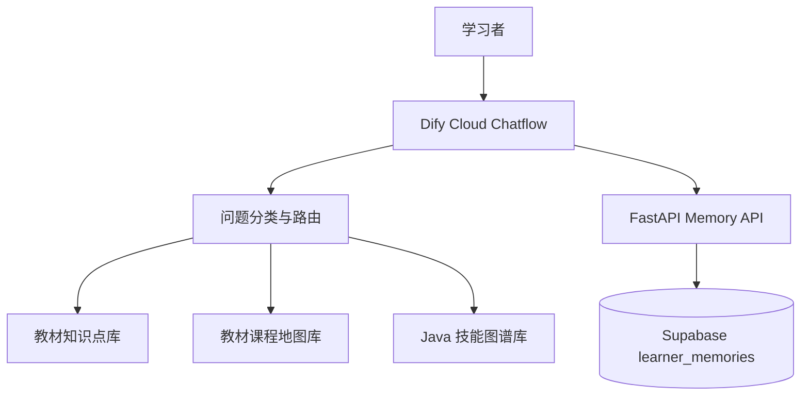
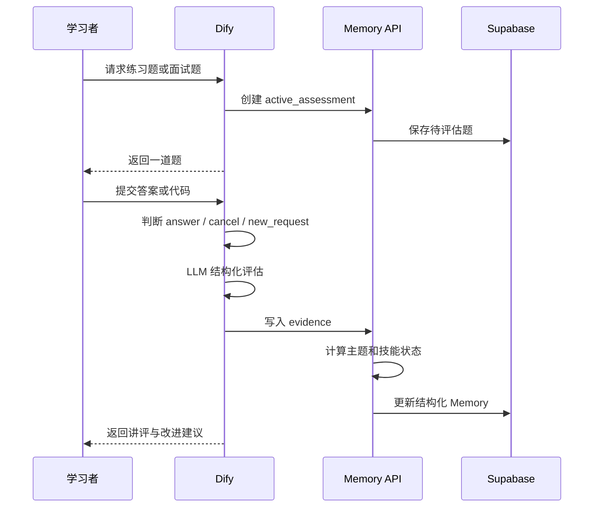
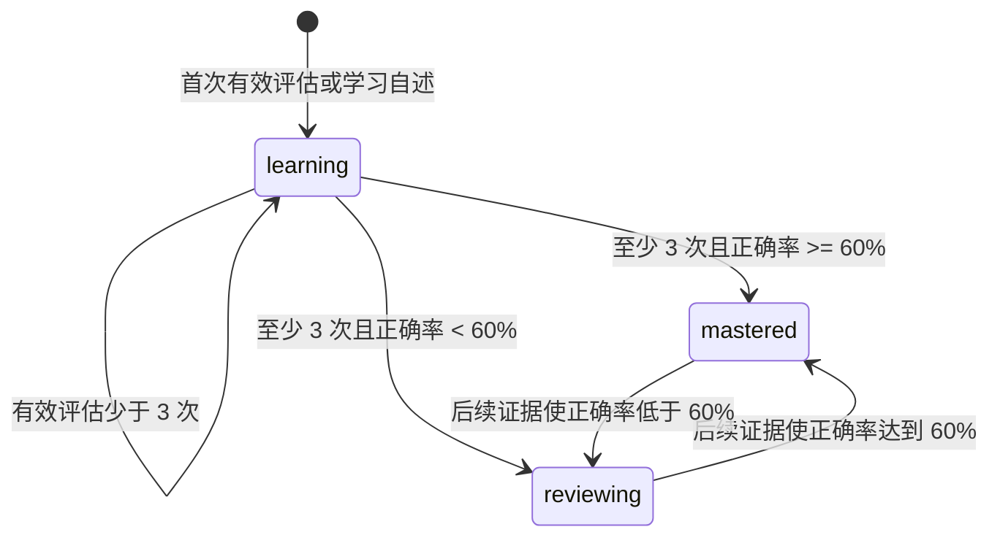
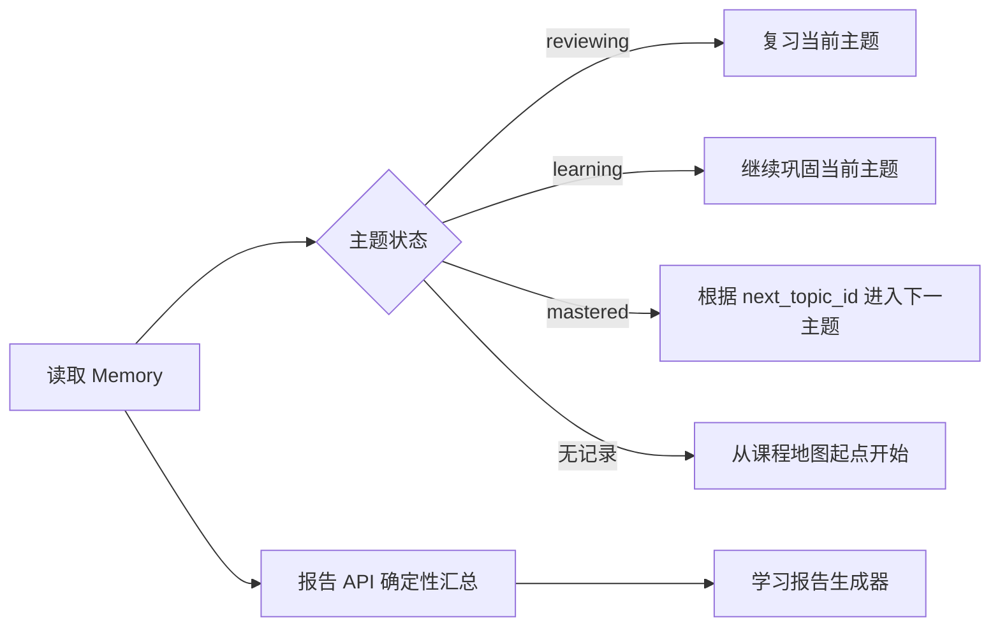

# CodeMentor AI 系统架构

## 组件职责

| 组件 | 职责 |
| --- | --- |
| Dify Chatflow | 对话编排、意图分类、检索、出题、讲评、学习报告展示。 |
| 教材知识点库 | 一个知识点一个 Markdown，提供回答、讲评和题目事实依据。 |
| 教材课程地图库 | 提供稳定 topic_id、先修依赖和 `next_topic_id`，决定学习顺序。 |
| Java 技能图谱库 | 提供原子技能、技能 ID、常见误区和出题定位。 |
| FastAPI Memory API | 鉴权、待评估题管理、证据写入、状态转换和报告统计。 |
| Supabase | 每位学习者一条 JSONB 结构化 Memory 记录。 |

## 答题与 Memory 数据流

## 状态规则

主题状态由后端按有效练习题和面试题证据计算：

`learning` 表示开始学习，不代表完成。学习报告的课程完成率只统计 `mastered` 主题。

## 继续学习与报告

报告 API 负责统计主题数量、正确率、状态和课程完成率；Dify LLM 只负责把返回的结构化数据整理为可读文本，不能自行计算或改变状态。
